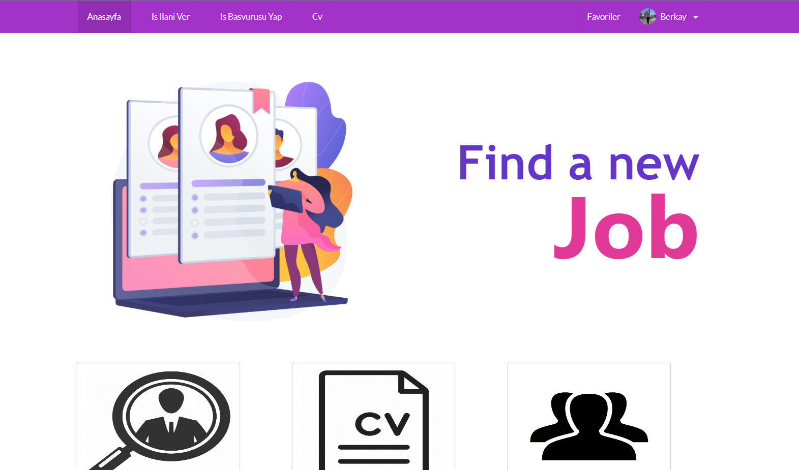
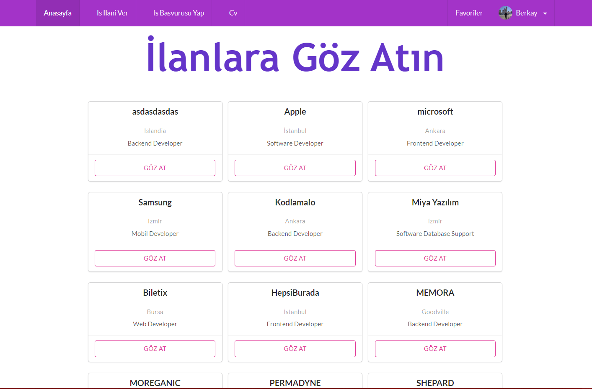
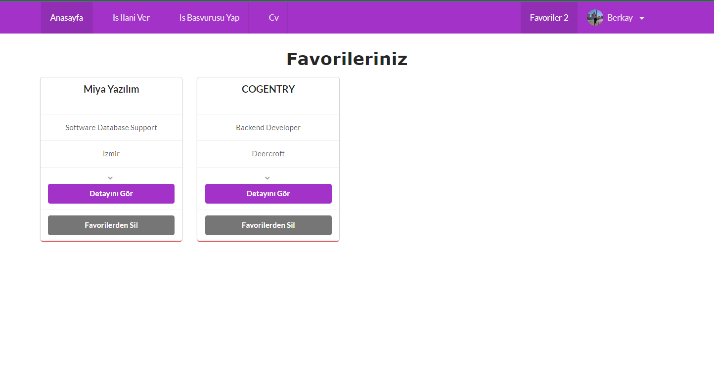
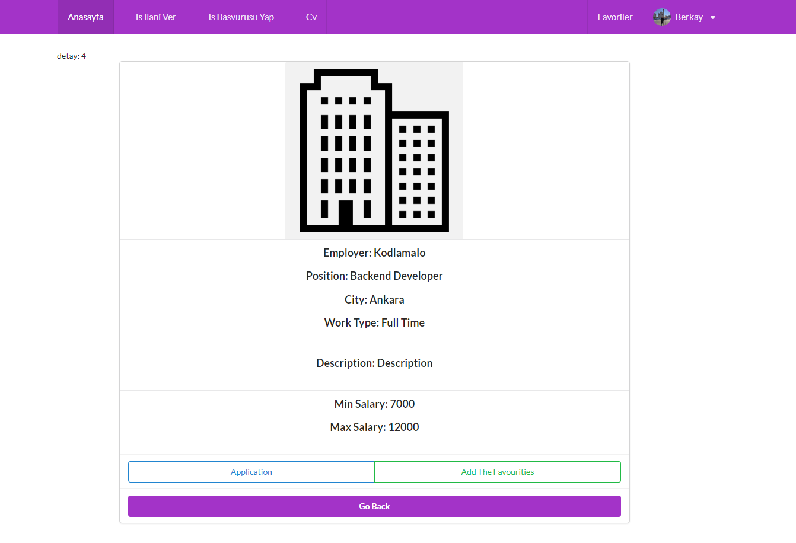
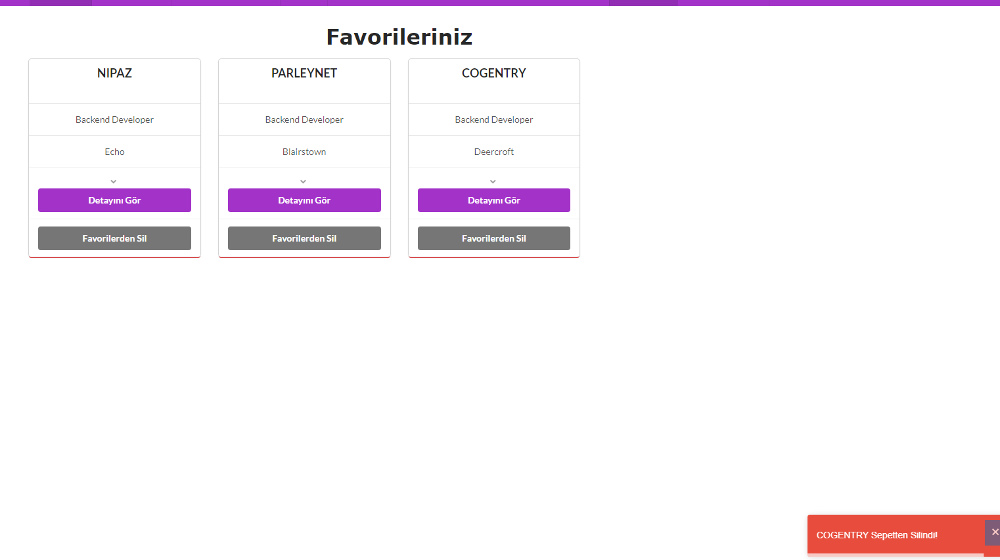
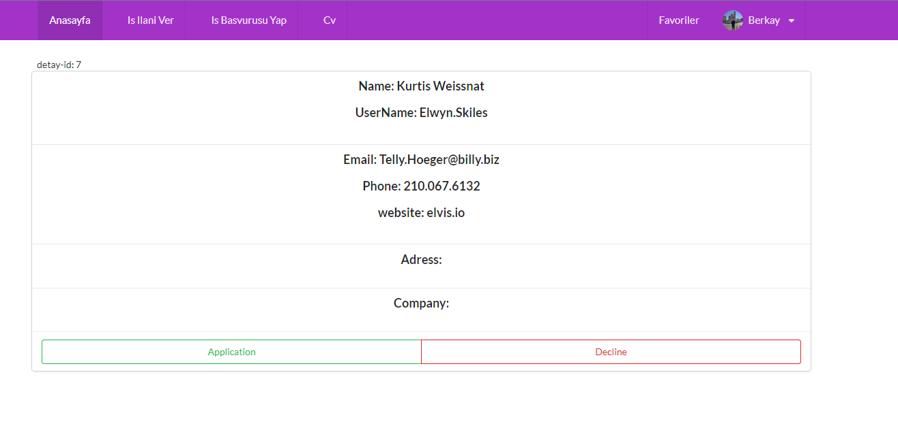

# React-HRMS

CV'nizi ekleyebilirsiniz. 

İş ilanı ekleyebilirsiz ve başvurabilirsiniz. 

İlanları favorilerinize ekleyebilir ve silebilirsiniz. 

 Backend https://github.com/Berkayergun16/HrmsBackendCore 

Kullandığım Paketler:  

<ul>
  <li>Semantic UI React</li>
  <li>Axios</li>
  <li>React Hooks</li>
  <li>React Hook Form</li>
  <li>React Toastify</li>
  <li>React Redux  </li>
  <li>React Notifications</li>
  <li>React Ag-Grid</li>
  <li>Graphql for Data Modelling</li>
</ul>
</img>
</img>
</img>
</img>
</img>
</img>

